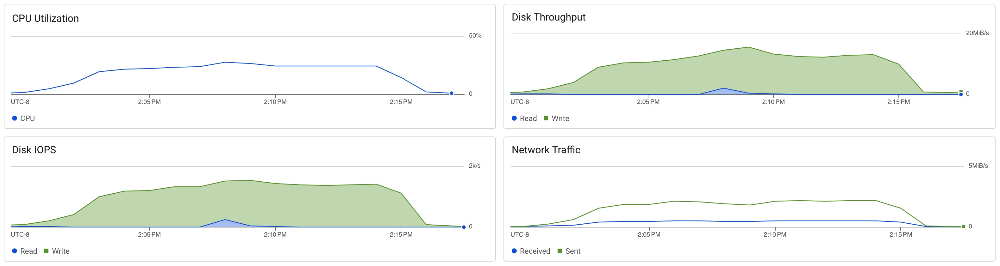

# Postgres Load Test

```sh
docker run -it char26/ycsb ./run_load.sh postgres <ip_address> -t 1
```

```
[OVERALL], RunTime(ms), 50098
[OVERALL], Throughput(ops/sec), 199.6087668170386
[TOTAL_GCS_PS_Scavenge], Count, 2
[TOTAL_GC_TIME_PS_Scavenge], Time(ms), 6
[TOTAL_GC_TIME_%_PS_Scavenge], Time(%), 0.011976526009022317
[TOTAL_GCS_PS_MarkSweep], Count, 0
[TOTAL_GC_TIME_PS_MarkSweep], Time(ms), 0
[TOTAL_GC_TIME_%_PS_MarkSweep], Time(%), 0.0
[TOTAL_GCs], Count, 2
[TOTAL_GC_TIME], Time(ms), 6
[TOTAL_GC_TIME_%], Time(%), 0.011976526009022317
[READ], Operations, 5059
[READ], AverageLatency(us), 456.82506424194503
[READ], MinLatency(us), 254
[READ], MaxLatency(us), 3397
[READ], 95thPercentileLatency(us), 604
[READ], 99thPercentileLatency(us), 767
[READ], Return=OK, 5059
[CLEANUP], Operations, 1
[CLEANUP], AverageLatency(us), 268.0
[CLEANUP], MinLatency(us), 268
[CLEANUP], MaxLatency(us), 268
[CLEANUP], 95thPercentileLatency(us), 268
[CLEANUP], 99thPercentileLatency(us), 268
[UPDATE], Operations, 4941
[UPDATE], AverageLatency(us), 618.8548876745598
[UPDATE], MinLatency(us), 410
[UPDATE], MaxLatency(us), 28127
[UPDATE], 95thPercentileLatency(us), 775
[UPDATE], 99thPercentileLatency(us), 922
[UPDATE], Return=OK, 4941
```

```
[OVERALL], RunTime(ms), 50096
[OVERALL], Throughput(ops/sec), 499.04183966783773
[TOTAL_GCS_PS_Scavenge], Count, 5
[TOTAL_GC_TIME_PS_Scavenge], Time(ms), 14
[TOTAL_GC_TIME_%_PS_Scavenge], Time(%), 0.027946343021398912
[TOTAL_GCS_PS_MarkSweep], Count, 0
[TOTAL_GC_TIME_PS_MarkSweep], Time(ms), 0
[TOTAL_GC_TIME_%_PS_MarkSweep], Time(%), 0.0
[TOTAL_GCs], Count, 5
[TOTAL_GC_TIME], Time(ms), 14
[TOTAL_GC_TIME_%], Time(%), 0.027946343021398912
[READ], Operations, 12565
[READ], AverageLatency(us), 421.67019498607243
[READ], MinLatency(us), 244
[READ], MaxLatency(us), 3067
[READ], 95thPercentileLatency(us), 547
[READ], 99thPercentileLatency(us), 619
[READ], Return=OK, 12565
[CLEANUP], Operations, 1
[CLEANUP], AverageLatency(us), 263.0
[CLEANUP], MinLatency(us), 263
[CLEANUP], MaxLatency(us), 263
[CLEANUP], 95thPercentileLatency(us), 263
[CLEANUP], 99thPercentileLatency(us), 263
[UPDATE], Operations, 12435
[UPDATE], AverageLatency(us), 566.2310414153599
[UPDATE], MinLatency(us), 378
[UPDATE], MaxLatency(us), 18223
[UPDATE], 95thPercentileLatency(us), 701
[UPDATE], 99thPercentileLatency(us), 782
[UPDATE], Return=OK, 12435
```

```
[OVERALL], RunTime(ms), 50095
[OVERALL], Throughput(ops/sec), 998.1036031540074
[TOTAL_GCS_PS_Scavenge], Count, 9
[TOTAL_GC_TIME_PS_Scavenge], Time(ms), 19
[TOTAL_GC_TIME_%_PS_Scavenge], Time(%), 0.03792793691985228
[TOTAL_GCS_PS_MarkSweep], Count, 0
[TOTAL_GC_TIME_PS_MarkSweep], Time(ms), 0
[TOTAL_GC_TIME_%_PS_MarkSweep], Time(%), 0.0
[TOTAL_GCs], Count, 9
[TOTAL_GC_TIME], Time(ms), 19
[TOTAL_GC_TIME_%], Time(%), 0.03792793691985228
[READ], Operations, 24898
[READ], AverageLatency(us), 388.2748815165877
[READ], MinLatency(us), 216
[READ], MaxLatency(us), 4619
[READ], 95thPercentileLatency(us), 505
[READ], 99thPercentileLatency(us), 585
[READ], Return=OK, 24898
[CLEANUP], Operations, 1
[CLEANUP], AverageLatency(us), 265.0
[CLEANUP], MinLatency(us), 265
[CLEANUP], MaxLatency(us), 265
[CLEANUP], 95thPercentileLatency(us), 265
[CLEANUP], 99thPercentileLatency(us), 265
[UPDATE], Operations, 25102
[UPDATE], AverageLatency(us), 516.1916181977532
[UPDATE], MinLatency(us), 356
[UPDATE], MaxLatency(us), 19647
[UPDATE], 95thPercentileLatency(us), 628
[UPDATE], 99thPercentileLatency(us), 716
[UPDATE], Return=OK, 25102
```

```
[OVERALL], RunTime(ms), 53384
[OVERALL], Throughput(ops/sec), 2341.5255507268093
[TOTAL_GCS_PS_Scavenge], Count, 27
[TOTAL_GC_TIME_PS_Scavenge], Time(ms), 33
[TOTAL_GC_TIME_%_PS_Scavenge], Time(%), 0.06181627453918777
[TOTAL_GCS_PS_MarkSweep], Count, 0
[TOTAL_GC_TIME_PS_MarkSweep], Time(ms), 0
[TOTAL_GC_TIME_%_PS_MarkSweep], Time(%), 0.0
[TOTAL_GCs], Count, 27
[TOTAL_GC_TIME], Time(ms), 33
[TOTAL_GC_TIME_%], Time(%), 0.06181627453918777
[READ], Operations, 62595
[READ], AverageLatency(us), 363.1762760603882
[READ], MinLatency(us), 183
[READ], MaxLatency(us), 8311
[READ], 95thPercentileLatency(us), 481
[READ], 99thPercentileLatency(us), 558
[READ], Return=OK, 62595
[CLEANUP], Operations, 1
[CLEANUP], AverageLatency(us), 316.0
[CLEANUP], MinLatency(us), 316
[CLEANUP], MaxLatency(us), 316
[CLEANUP], 95thPercentileLatency(us), 316
[CLEANUP], 99thPercentileLatency(us), 316
[UPDATE], Operations, 62405
[UPDATE], AverageLatency(us), 482.24041342841116
[UPDATE], MinLatency(us), 290
[UPDATE], MaxLatency(us), 21615
[UPDATE], 95thPercentileLatency(us), 592
[UPDATE], 99thPercentileLatency(us), 671
[UPDATE], Return=OK, 62405
```

```
[OVERALL], RunTime(ms), 108555
[OVERALL], Throughput(ops/sec), 2302.980056192713
[TOTAL_GCS_PS_Scavenge], Count, 57
[TOTAL_GC_TIME_PS_Scavenge], Time(ms), 47
[TOTAL_GC_TIME_%_PS_Scavenge], Time(%), 0.04329602505642301
[TOTAL_GCS_PS_MarkSweep], Count, 0
[TOTAL_GC_TIME_PS_MarkSweep], Time(ms), 0
[TOTAL_GC_TIME_%_PS_MarkSweep], Time(%), 0.0
[TOTAL_GCs], Count, 57
[TOTAL_GC_TIME], Time(ms), 47
[TOTAL_GC_TIME_%], Time(%), 0.04329602505642301
[READ], Operations, 125098
[READ], AverageLatency(us), 370.60081695950373
[READ], MinLatency(us), 182
[READ], MaxLatency(us), 4527
[READ], 95thPercentileLatency(us), 488
[READ], 99thPercentileLatency(us), 565
[READ], Return=OK, 125098
[CLEANUP], Operations, 1
[CLEANUP], AverageLatency(us), 241.0
[CLEANUP], MinLatency(us), 241
[CLEANUP], MaxLatency(us), 241
[CLEANUP], 95thPercentileLatency(us), 241
[CLEANUP], 99thPercentileLatency(us), 241
[UPDATE], Operations, 124902
[UPDATE], AverageLatency(us), 491.1079886631119
[UPDATE], MinLatency(us), 298
[UPDATE], MaxLatency(us), 23791
[UPDATE], 95thPercentileLatency(us), 600
[UPDATE], 99thPercentileLatency(us), 671
[UPDATE], Return=OK, 124902
```

```
[OVERALL], RunTime(ms), 205564
[OVERALL], Throughput(ops/sec), 2432.33250958339
[TOTAL_GCS_PS_Scavenge], Count, 120
[TOTAL_GC_TIME_PS_Scavenge], Time(ms), 84
[TOTAL_GC_TIME_%_PS_Scavenge], Time(%), 0.04086318616100095
[TOTAL_GCS_PS_MarkSweep], Count, 0
[TOTAL_GC_TIME_PS_MarkSweep], Time(ms), 0
[TOTAL_GC_TIME_%_PS_MarkSweep], Time(%), 0.0
[TOTAL_GCs], Count, 120
[TOTAL_GC_TIME], Time(ms), 84
[TOTAL_GC_TIME_%], Time(%), 0.04086318616100095
[READ], Operations, 250708
[READ], AverageLatency(us), 343.42905691082854
[READ], MinLatency(us), 162
[READ], MaxLatency(us), 15543
[READ], 95thPercentileLatency(us), 469
[READ], 99thPercentileLatency(us), 666
[READ], Return=OK, 250708
[CLEANUP], Operations, 1
[CLEANUP], AverageLatency(us), 271.0
[CLEANUP], MinLatency(us), 271
[CLEANUP], MaxLatency(us), 271
[CLEANUP], 95thPercentileLatency(us), 271
[CLEANUP], 99thPercentileLatency(us), 271
[UPDATE], Operations, 249292
[UPDATE], AverageLatency(us), 473.41451390337437
[UPDATE], MinLatency(us), 281
[UPDATE], MaxLatency(us), 32287
[UPDATE], 95thPercentileLatency(us), 613
[UPDATE], 99thPercentileLatency(us), 1113
[UPDATE], Return=OK, 249292
```

```
[OVERALL], RunTime(ms), 376510
[OVERALL], Throughput(ops/sec), 2655.971952936177
[TOTAL_GCS_PS_Scavenge], Count, 243
[TOTAL_GC_TIME_PS_Scavenge], Time(ms), 154
[TOTAL_GC_TIME_%_PS_Scavenge], Time(%), 0.04090196807521713
[TOTAL_GCS_PS_MarkSweep], Count, 0
[TOTAL_GC_TIME_PS_MarkSweep], Time(ms), 0
[TOTAL_GC_TIME_%_PS_MarkSweep], Time(%), 0.0
[TOTAL_GCs], Count, 243
[TOTAL_GC_TIME], Time(ms), 154
[TOTAL_GC_TIME_%], Time(%), 0.04090196807521713
[READ], Operations, 499783
[READ], AverageLatency(us), 318.7203026113333
[READ], MinLatency(us), 153
[READ], MaxLatency(us), 4871
[READ], 95thPercentileLatency(us), 422
[READ], 99thPercentileLatency(us), 507
[READ], Return=OK, 499783
[CLEANUP], Operations, 1
[CLEANUP], AverageLatency(us), 240.0
[CLEANUP], MinLatency(us), 240
[CLEANUP], MaxLatency(us), 240
[CLEANUP], 95thPercentileLatency(us), 240
[CLEANUP], 99thPercentileLatency(us), 240
[UPDATE], Operations, 500217
[UPDATE], AverageLatency(us), 428.5574400710092
[UPDATE], MinLatency(us), 264
[UPDATE], MaxLatency(us), 62623
[UPDATE], 95thPercentileLatency(us), 530
[UPDATE], 99thPercentileLatency(us), 618
[UPDATE], Return=OK, 500217
```



Postgres doesn't seem to be doing much caching?

