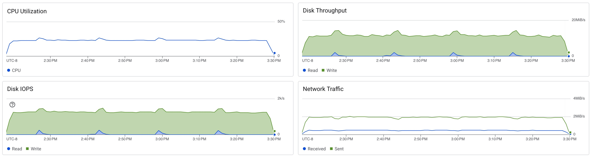

# Postgres Stress Test

```sh
docker run -it char26/ycsb ./run_stress.sh postgres <ip_address> -t 1
```

```
[OVERALL], RunTime(ms), 4220495
[OVERALL], Throughput(ops/sec), 2369.3903203297245
[TOTAL_GCS_PS_Scavenge], Count, 2462
[TOTAL_GC_TIME_PS_Scavenge], Time(ms), 1709
[TOTAL_GC_TIME_%_PS_Scavenge], Time(%), 0.040492880574434995
[TOTAL_GCS_PS_MarkSweep], Count, 0
[TOTAL_GC_TIME_PS_MarkSweep], Time(ms), 0
[TOTAL_GC_TIME_%_PS_MarkSweep], Time(%), 0.0
[TOTAL_GCs], Count, 2462
[TOTAL_GC_TIME], Time(ms), 1709
[TOTAL_GC_TIME_%], Time(%), 0.040492880574434995
[READ], Operations, 5000960
[READ], AverageLatency(us), 359.2255942858971
[READ], MinLatency(us), 156
[READ], MaxLatency(us), 9423
[READ], 95thPercentileLatency(us), 487
[READ], 99thPercentileLatency(us), 580
[READ], Return=OK, 5000960
[CLEANUP], Operations, 1
[CLEANUP], AverageLatency(us), 410.0
[CLEANUP], MinLatency(us), 410
[CLEANUP], MaxLatency(us), 410
[CLEANUP], 95thPercentileLatency(us), 410
[CLEANUP], 99thPercentileLatency(us), 410
[UPDATE], Operations, 4999040
[UPDATE], AverageLatency(us), 480.09404365638204
[UPDATE], MinLatency(us), 277
[UPDATE], MaxLatency(us), 74623
[UPDATE], 95thPercentileLatency(us), 600
[UPDATE], 99thPercentileLatency(us), 714
[UPDATE], Return=OK, 4999040
```


