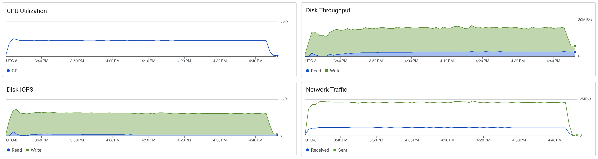

# Postgres Soak Test

```sh
docker run -it char26/ycsb ./run_soak.sh postgres <ip_address> -t 1
```

```
[OVERALL], RunTime(ms), 4386482
[OVERALL], Throughput(ops/sec), 2279.7312288070484
[TOTAL_GCS_PS_Scavenge], Count, 2482
[TOTAL_GC_TIME_PS_Scavenge], Time(ms), 1830
[TOTAL_GC_TIME_%_PS_Scavenge], Time(%), 0.04171908148716899
[TOTAL_GCS_PS_MarkSweep], Count, 0
[TOTAL_GC_TIME_PS_MarkSweep], Time(ms), 0
[TOTAL_GC_TIME_%_PS_MarkSweep], Time(%), 0.0
[TOTAL_GCs], Count, 2482
[TOTAL_GC_TIME], Time(ms), 1830
[TOTAL_GC_TIME_%], Time(%), 0.04171908148716899
[READ], Operations, 4999465
[READ], AverageLatency(us), 375.4057216122125
[READ], MinLatency(us), 164
[READ], MaxLatency(us), 5715
[READ], 95thPercentileLatency(us), 504
[READ], 99thPercentileLatency(us), 584
[READ], Return=OK, 4999465
[CLEANUP], Operations, 1
[CLEANUP], AverageLatency(us), 291.0
[CLEANUP], MinLatency(us), 291
[CLEANUP], MaxLatency(us), 291
[CLEANUP], 95thPercentileLatency(us), 291
[CLEANUP], 99thPercentileLatency(us), 291
[UPDATE], Operations, 5000535
[UPDATE], AverageLatency(us), 497.2228587541133
[UPDATE], MinLatency(us), 284
[UPDATE], MaxLatency(us), 191871
[UPDATE], 95thPercentileLatency(us), 616
[UPDATE], 99thPercentileLatency(us), 706
[UPDATE], Return=OK, 5000535
```


