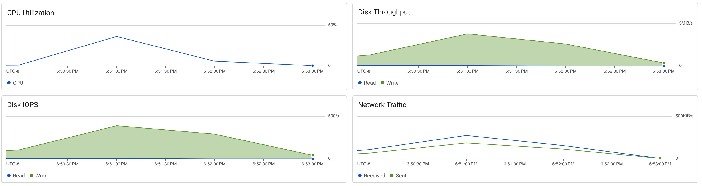
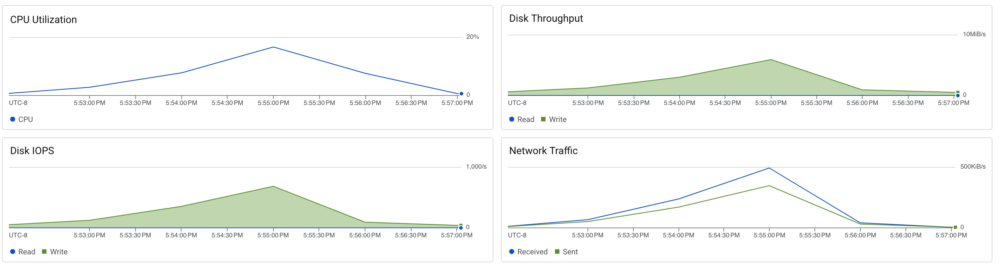
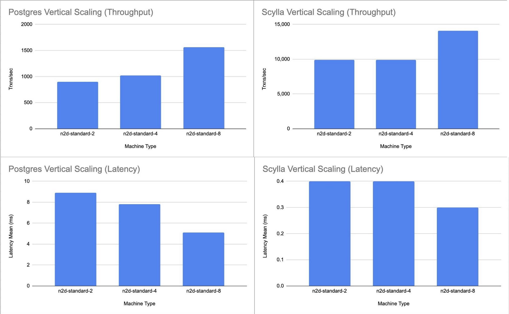

# Postgres Vertical Scaling

```sh
docker run -e PGPASSWORD=changeme --rm postgres:9.6 pgbench -h <ip_address> -p 5433 -U postgres -d test -i
docker run -e PGPASSWORD=changeme --rm postgres:9.6 pgbench -h <ip_address> -p 5433 -U postgres -d test --client 8 --jobs 8 --transactions 5000
```

## n2d-standard-2

```
pghost: 10.128.0.63 pgport: 5433 nclients: 8 nxacts: 5000 dbName: test
transaction type: <builtin: TPC-B (sort of)>
scaling factor: 1
query mode: simple
number of clients: 8
number of threads: 8
number of transactions per client: 5000
number of transactions actually processed: 40000/40000
latency average = 8.915 ms
tps = 897.391695 (including connections establishing)
tps = 897.585752 (excluding connections establishing)
```




## n2d-standard-4

```
pghost: 10.128.0.60 pgport: 5433 nclients: 8 nxacts: 5000 dbName: test
transaction type: <builtin: TPC-B (sort of)>
scaling factor: 1
query mode: simple
number of clients: 8
number of threads: 8
number of transactions per client: 5000
number of transactions actually processed: 40000/40000
latency average = 7.807 ms
tps = 1024.712137 (including connections establishing)
tps = 1024.875473 (excluding connections establishing)
```



## n2d-standard-8

```
pghost: 10.128.15.198 pgport: 5433 nclients: 8 nxacts: 5000 dbName: test
transaction type: <builtin: TPC-B (sort of)>
scaling factor: 1
query mode: simple
number of clients: 8
number of threads: 8
number of transactions per client: 5000
number of transactions actually processed: 40000/40000
latency average = 5.114 ms
tps = 1564.293927 (including connections establishing)
tps = 1564.590478 (excluding connections establishing)
```


