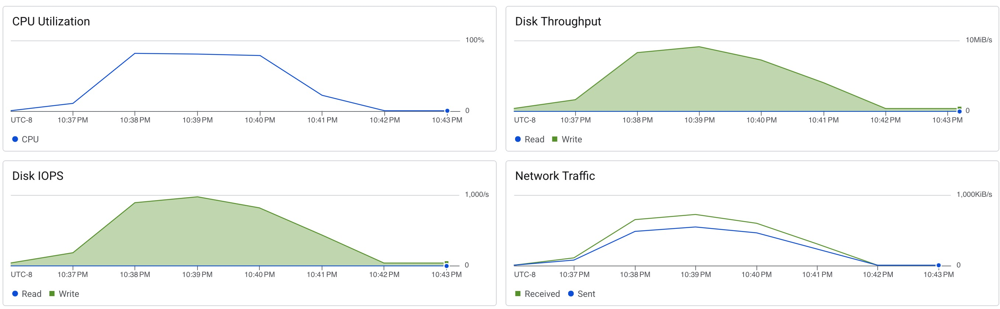

8 clients -> 75 clients -> 8 clients -> 100 clients

```
pghost: 10.128.0.12 pgport: 5433 nclients: 100 nxacts: 1000 dbName: test
transaction type: <builtin: TPC-B (sort of)>
scaling factor: 1
query mode: simple
number of clients: 100
number of threads: 8
number of transactions per client: 1000
number of transactions actually processed: 100000/100000
latency average = 116.974 ms
tps = 854.893542 (including connections establishing)
tps = 854.974560 (excluding connections establishing)
```


