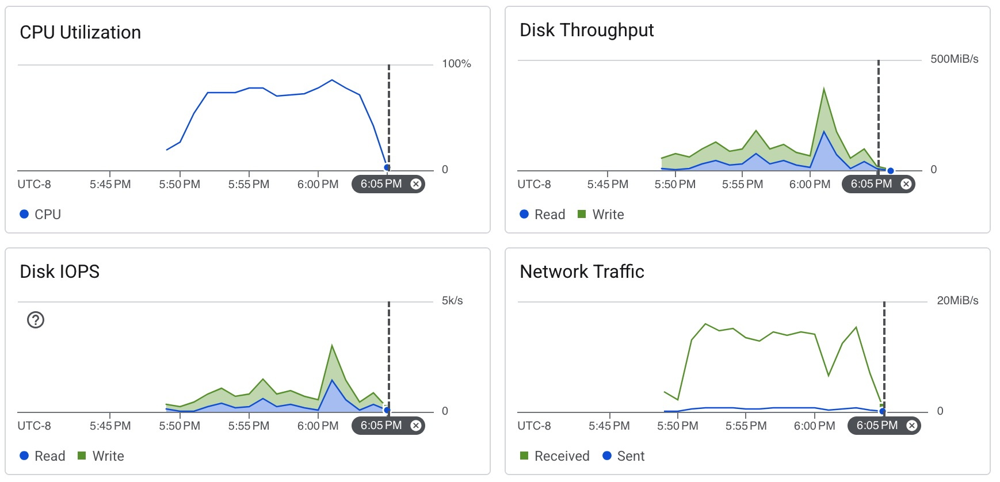

# Scylla Insert

```sh
docker run -it char26/ycsb ./insert_scylla.sh <ip_address> -t 8
```

```
[OVERALL], RunTime(ms), 819236
[OVERALL], Throughput(ops/sec), 12206.494831770087
[TOTAL_GCS_PS_Scavenge], Count, 1958
[TOTAL_GC_TIME_PS_Scavenge], Time(ms), 5893
[TOTAL_GC_TIME_%_PS_Scavenge], Time(%), 0.7193287404362113
[TOTAL_GCS_PS_MarkSweep], Count, 0
[TOTAL_GC_TIME_PS_MarkSweep], Time(ms), 0
[TOTAL_GC_TIME_%_PS_MarkSweep], Time(%), 0.0
[TOTAL_GCs], Count, 1958
[TOTAL_GC_TIME], Time(ms), 5893
[TOTAL_GC_TIME_%], Time(%), 0.7193287404362113
[CLEANUP], Operations, 8
[CLEANUP], AverageLatency(us), 276867.875
[CLEANUP], MinLatency(us), 2
[CLEANUP], MaxLatency(us), 2215935
[CLEANUP], 95thPercentileLatency(us), 2215935
[CLEANUP], 99thPercentileLatency(us), 2215935
[INSERT], Operations, 10000000
[INSERT], AverageLatency(us), 650.7128234
[INSERT], MinLatency(us), 196
[INSERT], MaxLatency(us), 31231
[INSERT], 95thPercentileLatency(us), 1965
[INSERT], 99thPercentileLatency(us), 2585
[INSERT], Return=OK, 10000000
```



