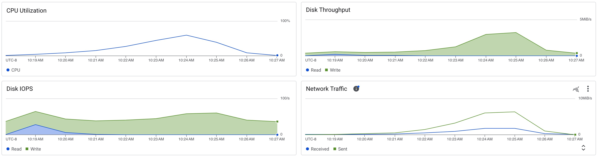

# Scylla Load Test

```sh
docker run -it char26/ycsb ./run_load.sh scylla <ip_address> -t 8
```

## Target Ops/Sec = 200

```
[OVERALL], RunTime(ms), 52985
[OVERALL], Throughput(ops/sec), 188.73266018684532
[TOTAL_GCS_PS_Scavenge], Count, 4
[TOTAL_GC_TIME_PS_Scavenge], Time(ms), 28
[TOTAL_GC_TIME_%_PS_Scavenge], Time(%), 0.05284514485231669
[TOTAL_GCS_PS_MarkSweep], Count, 0
[TOTAL_GC_TIME_PS_MarkSweep], Time(ms), 0
[TOTAL_GC_TIME_%_PS_MarkSweep], Time(%), 0.0
[TOTAL_GCs], Count, 4
[TOTAL_GC_TIME], Time(ms), 28
[TOTAL_GC_TIME_%], Time(%), 0.05284514485231669
[READ], Operations, 5027
[READ], AverageLatency(us), 887.9516610304356
[READ], MinLatency(us), 325
[READ], MaxLatency(us), 8223
[READ], 95thPercentileLatency(us), 1683
[READ], 99thPercentileLatency(us), 2071
[READ], Return=OK, 5027
[CLEANUP], Operations, 8
[CLEANUP], AverageLatency(us), 276611.75
[CLEANUP], MinLatency(us), 1
[CLEANUP], MaxLatency(us), 2213887
[CLEANUP], 95thPercentileLatency(us), 2213887
[CLEANUP], 99thPercentileLatency(us), 2213887
[UPDATE], Operations, 4973
[UPDATE], AverageLatency(us), 734.6225618339031
[UPDATE], MinLatency(us), 308
[UPDATE], MaxLatency(us), 17439
[UPDATE], 95thPercentileLatency(us), 1114
[UPDATE], 99thPercentileLatency(us), 1599
[UPDATE], Return=OK, 4973
```

## Target Ops/Sec = 500

```
[OVERALL], RunTime(ms), 52954
[OVERALL], Throughput(ops/sec), 472.10786720549913
[TOTAL_GCS_PS_Scavenge], Count, 8
[TOTAL_GC_TIME_PS_Scavenge], Time(ms), 52
[TOTAL_GC_TIME_%_PS_Scavenge], Time(%), 0.09819843637874381
[TOTAL_GCS_PS_MarkSweep], Count, 0
[TOTAL_GC_TIME_PS_MarkSweep], Time(ms), 0
[TOTAL_GC_TIME_%_PS_MarkSweep], Time(%), 0.0
[TOTAL_GCs], Count, 8
[TOTAL_GC_TIME], Time(ms), 52
[TOTAL_GC_TIME_%], Time(%), 0.09819843637874381
[READ], Operations, 12827
[READ], AverageLatency(us), 663.1330786621969
[READ], MinLatency(us), 281
[READ], MaxLatency(us), 27711
[READ], 95thPercentileLatency(us), 1003
[READ], 99thPercentileLatency(us), 1421
[READ], Return=OK, 12827
[CLEANUP], Operations, 8
[CLEANUP], AverageLatency(us), 276867.5
[CLEANUP], MinLatency(us), 1
[CLEANUP], MaxLatency(us), 2215935
[CLEANUP], 95thPercentileLatency(us), 2215935
[CLEANUP], 99thPercentileLatency(us), 2215935
[UPDATE], Operations, 12173
[UPDATE], AverageLatency(us), 606.8303622771708
[UPDATE], MinLatency(us), 250
[UPDATE], MaxLatency(us), 27359
[UPDATE], 95thPercentileLatency(us), 935
[UPDATE], 99thPercentileLatency(us), 1328
[UPDATE], Return=OK, 12173
```

## Target Ops/Sec = 1000

```
[OVERALL], RunTime(ms), 52947
[OVERALL], Throughput(ops/sec), 944.3405669820764
[TOTAL_GCS_PS_Scavenge], Count, 15
[TOTAL_GC_TIME_PS_Scavenge], Time(ms), 61
[TOTAL_GC_TIME_%_PS_Scavenge], Time(%), 0.11520954917181331
[TOTAL_GCS_PS_MarkSweep], Count, 0
[TOTAL_GC_TIME_PS_MarkSweep], Time(ms), 0
[TOTAL_GC_TIME_%_PS_MarkSweep], Time(%), 0.0
[TOTAL_GCs], Count, 15
[TOTAL_GC_TIME], Time(ms), 61
[TOTAL_GC_TIME_%], Time(%), 0.11520954917181331
[READ], Operations, 25042
[READ], AverageLatency(us), 544.8502915102628
[READ], MinLatency(us), 252
[READ], MaxLatency(us), 25295
[READ], 95thPercentileLatency(us), 803
[READ], 99thPercentileLatency(us), 1484
[READ], Return=OK, 25042
[CLEANUP], Operations, 8
[CLEANUP], AverageLatency(us), 277378.5
[CLEANUP], MinLatency(us), 1
[CLEANUP], MaxLatency(us), 2220031
[CLEANUP], 95thPercentileLatency(us), 2220031
[CLEANUP], 99thPercentileLatency(us), 2220031
[UPDATE], Operations, 24958
[UPDATE], AverageLatency(us), 496.7534658225819
[UPDATE], MinLatency(us), 211
[UPDATE], MaxLatency(us), 27487
[UPDATE], 95thPercentileLatency(us), 726
[UPDATE], 99thPercentileLatency(us), 1287
[UPDATE], Return=OK, 24958
```

## Target Ops/Sec = 2500

```
[OVERALL], RunTime(ms), 52936
[OVERALL], Throughput(ops/sec), 2361.3419978842376
[TOTAL_GCS_PS_Scavenge], Count, 20
[TOTAL_GC_TIME_PS_Scavenge], Time(ms), 69
[TOTAL_GC_TIME_%_PS_Scavenge], Time(%), 0.1303460782832099
[TOTAL_GCS_PS_MarkSweep], Count, 0
[TOTAL_GC_TIME_PS_MarkSweep], Time(ms), 0
[TOTAL_GC_TIME_%_PS_MarkSweep], Time(%), 0.0
[TOTAL_GCs], Count, 20
[TOTAL_GC_TIME], Time(ms), 69
[TOTAL_GC_TIME_%], Time(%), 0.1303460782832099
[READ], Operations, 62839
[READ], AverageLatency(us), 534.5957605945352
[READ], MinLatency(us), 233
[READ], MaxLatency(us), 28175
[READ], 95thPercentileLatency(us), 791
[READ], 99thPercentileLatency(us), 1953
[READ], Return=OK, 62839
[CLEANUP], Operations, 8
[CLEANUP], AverageLatency(us), 276865.875
[CLEANUP], MinLatency(us), 0
[CLEANUP], MaxLatency(us), 2215935
[CLEANUP], 95thPercentileLatency(us), 2215935
[CLEANUP], 99thPercentileLatency(us), 2215935
[UPDATE], Operations, 62161
[UPDATE], AverageLatency(us), 497.6617654156143
[UPDATE], MinLatency(us), 217
[UPDATE], MaxLatency(us), 30191
[UPDATE], 95thPercentileLatency(us), 738
[UPDATE], 99thPercentileLatency(us), 2181
[UPDATE], Return=OK, 62161
```

## Target Ops/Sec = 5000

```
[OVERALL], RunTime(ms), 52948
[OVERALL], Throughput(ops/sec), 4721.613658683992
[TOTAL_GCS_PS_Scavenge], Count, 50
[TOTAL_GC_TIME_PS_Scavenge], Time(ms), 122
[TOTAL_GC_TIME_%_PS_Scavenge], Time(%), 0.2304147465437788
[TOTAL_GCS_PS_MarkSweep], Count, 0
[TOTAL_GC_TIME_PS_MarkSweep], Time(ms), 0
[TOTAL_GC_TIME_%_PS_MarkSweep], Time(%), 0.0
[TOTAL_GCs], Count, 50
[TOTAL_GC_TIME], Time(ms), 122
[TOTAL_GC_TIME_%], Time(%), 0.2304147465437788
[READ], Operations, 125422
[READ], AverageLatency(us), 483.0289422908262
[READ], MinLatency(us), 217
[READ], MaxLatency(us), 27823
[READ], 95thPercentileLatency(us), 747
[READ], 99thPercentileLatency(us), 1288
[READ], Return=OK, 125422
[CLEANUP], Operations, 8
[CLEANUP], AverageLatency(us), 277633.75
[CLEANUP], MinLatency(us), 0
[CLEANUP], MaxLatency(us), 2222079
[CLEANUP], 95thPercentileLatency(us), 2222079
[CLEANUP], 99thPercentileLatency(us), 2222079
[UPDATE], Operations, 124578
[UPDATE], AverageLatency(us), 446.5143685080833
[UPDATE], MinLatency(us), 191
[UPDATE], MaxLatency(us), 27615
[UPDATE], 95thPercentileLatency(us), 718
[UPDATE], 99thPercentileLatency(us), 1312
[UPDATE], Return=OK, 124578
```

## Target Ops/Sec = 10000

```
[OVERALL], RunTime(ms), 52930
[OVERALL], Throughput(ops/sec), 9446.438692612885
[TOTAL_GCS_PS_Scavenge], Count, 69
[TOTAL_GC_TIME_PS_Scavenge], Time(ms), 192
[TOTAL_GC_TIME_%_PS_Scavenge], Time(%), 0.36274324579633477
[TOTAL_GCS_PS_MarkSweep], Count, 0
[TOTAL_GC_TIME_PS_MarkSweep], Time(ms), 0
[TOTAL_GC_TIME_%_PS_MarkSweep], Time(%), 0.0
[TOTAL_GCs], Count, 69
[TOTAL_GC_TIME], Time(ms), 192
[TOTAL_GC_TIME_%], Time(%), 0.36274324579633477
[READ], Operations, 249858
[READ], AverageLatency(us), 499.552537841494
[READ], MinLatency(us), 222
[READ], MaxLatency(us), 34015
[READ], 95thPercentileLatency(us), 805
[READ], 99thPercentileLatency(us), 1264
[READ], Return=OK, 249858
[CLEANUP], Operations, 8
[CLEANUP], AverageLatency(us), 278146.125
[CLEANUP], MinLatency(us), 0
[CLEANUP], MaxLatency(us), 2226175
[CLEANUP], 95thPercentileLatency(us), 2226175
[CLEANUP], 99thPercentileLatency(us), 2226175
[UPDATE], Operations, 250142
[UPDATE], AverageLatency(us), 476.4700130325975
[UPDATE], MinLatency(us), 197
[UPDATE], MaxLatency(us), 34463
[UPDATE], 95thPercentileLatency(us), 821
[UPDATE], 99thPercentileLatency(us), 1301
[UPDATE], Return=OK, 250142
```

## Target Ops/Sec = 20000

```
[OVERALL], RunTime(ms), 64518
[OVERALL], Throughput(ops/sec), 15499.550513035121
[TOTAL_GCS_PS_Scavenge], Count, 83
[TOTAL_GC_TIME_PS_Scavenge], Time(ms), 314
[TOTAL_GC_TIME_%_PS_Scavenge], Time(%), 0.48668588610930286
[TOTAL_GCS_PS_MarkSweep], Count, 0
[TOTAL_GC_TIME_PS_MarkSweep], Time(ms), 0
[TOTAL_GC_TIME_%_PS_MarkSweep], Time(%), 0.0
[TOTAL_GCs], Count, 83
[TOTAL_GC_TIME], Time(ms), 314
[TOTAL_GC_TIME_%], Time(%), 0.48668588610930286
[READ], Operations, 499628
[READ], AverageLatency(us), 495.8119280744874
[READ], MinLatency(us), 212
[READ], MaxLatency(us), 32159
[READ], 95thPercentileLatency(us), 740
[READ], 99thPercentileLatency(us), 1068
[READ], Return=OK, 499628
[CLEANUP], Operations, 8
[CLEANUP], AverageLatency(us), 277124.375
[CLEANUP], MinLatency(us), 1
[CLEANUP], MaxLatency(us), 2217983
[CLEANUP], 95thPercentileLatency(us), 2217983
[CLEANUP], 99thPercentileLatency(us), 2217983
[UPDATE], Operations, 500372
[UPDATE], AverageLatency(us), 483.0824146834755
[UPDATE], MinLatency(us), 191
[UPDATE], MaxLatency(us), 31999
[UPDATE], 95thPercentileLatency(us), 749
[UPDATE], 99thPercentileLatency(us), 1099
[UPDATE], Return=OK, 500372
```


