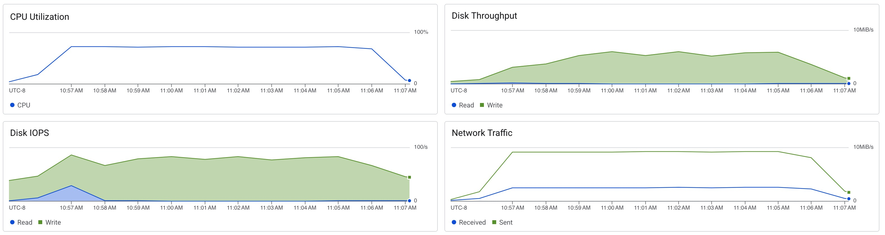

# Scylla Stress Test

```sh
docker run -it char26/ycsb ./run_stress.sh scylla <ip_address> -t 8
```

```
[OVERALL], RunTime(ms), 621695
[OVERALL], Throughput(ops/sec), 16085.057785570094
[TOTAL_GCS_PS_Scavenge], Count, 1990
[TOTAL_GC_TIME_PS_Scavenge], Time(ms), 5201
[TOTAL_GC_TIME_%_PS_Scavenge], Time(%), 0.8365838554275007
[TOTAL_GCS_PS_MarkSweep], Count, 0
[TOTAL_GC_TIME_PS_MarkSweep], Time(ms), 0
[TOTAL_GC_TIME_%_PS_MarkSweep], Time(%), 0.0
[TOTAL_GCs], Count, 1990
[TOTAL_GC_TIME], Time(ms), 5201
[TOTAL_GC_TIME_%], Time(%), 0.8365838554275007
[READ], Operations, 5001979
[READ], AverageLatency(us), 502.98397114422113
[READ], MinLatency(us), 186
[READ], MaxLatency(us), 32303
[READ], 95thPercentileLatency(us), 733
[READ], 99thPercentileLatency(us), 1049
[READ], Return=OK, 5001979
[CLEANUP], Operations, 8
[CLEANUP], AverageLatency(us), 276868.5
[CLEANUP], MinLatency(us), 4
[CLEANUP], MaxLatency(us), 2215935
[CLEANUP], 95thPercentileLatency(us), 2215935
[CLEANUP], 99thPercentileLatency(us), 2215935
[UPDATE], Operations, 4998021
[UPDATE], AverageLatency(us), 482.3758641670373
[UPDATE], MinLatency(us), 164
[UPDATE], MaxLatency(us), 29951
[UPDATE], 95thPercentileLatency(us), 725
[UPDATE], 99thPercentileLatency(us), 1036
[UPDATE], Return=OK, 4998021
```


