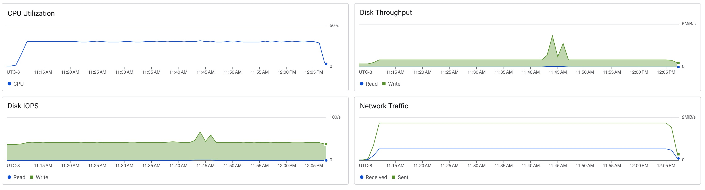

# Scylla Soak Test

```sh
docker run -it char26/ycsb ./run_soak.sh scylla <ip_address> -t 8
```

```
[OVERALL], RunTime(ms), 3336301
[OVERALL], Throughput(ops/sec), 2997.3314757871067
[TOTAL_GCS_PS_Scavenge], Count, 3385
[TOTAL_GC_TIME_PS_Scavenge], Time(ms), 4601
[TOTAL_GC_TIME_%_PS_Scavenge], Time(%), 0.13790722120096477
[TOTAL_GCS_PS_MarkSweep], Count, 1
[TOTAL_GC_TIME_PS_MarkSweep], Time(ms), 31
[TOTAL_GC_TIME_%_PS_MarkSweep], Time(%), 9.29172757494003E-4
[TOTAL_GCs], Count, 3386
[TOTAL_GC_TIME], Time(ms), 4632
[TOTAL_GC_TIME_%], Time(%), 0.1388363939584588
[READ], Operations, 4998764
[READ], AverageLatency(us), 476.7570383398776
[READ], MinLatency(us), 192
[READ], MaxLatency(us), 33887
[READ], 95thPercentileLatency(us), 665
[READ], 99thPercentileLatency(us), 875
[READ], Return=OK, 4998764
[CLEANUP], Operations, 8
[CLEANUP], AverageLatency(us), 277377.625
[CLEANUP], MinLatency(us), 0
[CLEANUP], MaxLatency(us), 2220031
[CLEANUP], 95thPercentileLatency(us), 2220031
[CLEANUP], 99thPercentileLatency(us), 2220031
[UPDATE], Operations, 5001236
[UPDATE], AverageLatency(us), 421.6611933530031
[UPDATE], MinLatency(us), 162
[UPDATE], MaxLatency(us), 33759
[UPDATE], 95thPercentileLatency(us), 598
[UPDATE], 99thPercentileLatency(us), 809
[UPDATE], Return=OK, 5001236
```



