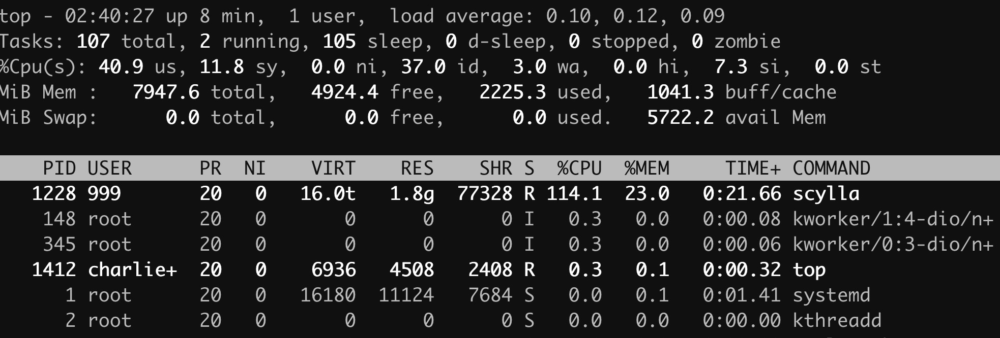
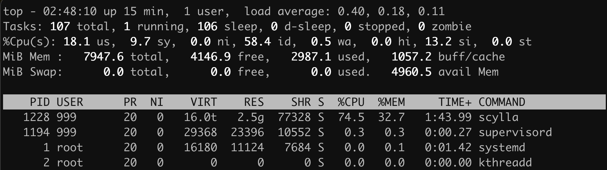
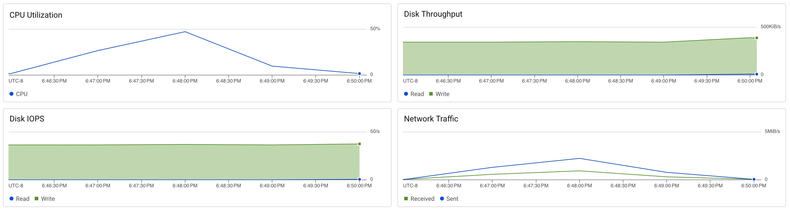

# Scylla Vertical Scaling

```sh
docker run --rm --network=host --security-opt seccomp=unconfined scylladb/cassandra-stress 'write n=1000000 -node <ip_address>'
docker run --rm --network=host --security-opt seccomp=unconfined scylladb/cassandra-stress 'read n=1000000 -node <ip_address>'
```

GCP Observability Monitoring only collects stats every 60 seconds. It missed the quick write burst entirely.

## n2d-standard-2

```
Op rate : 35,307 op/s [WRITE: 35,307 op/s]
Partition rate : 35,307 pk/s [WRITE: 35,307 pk/s]
Row rate : 35,307 row/s [WRITE: 35,307 row/s]
Latency mean : 5.5 ms [WRITE: 5.5 ms]
Latency median : 4.6 ms [WRITE: 4.6 ms]
Latency 95th percentile : 12.5 ms [WRITE: 12.5 ms]
Latency 99th percentile : 18.3 ms [WRITE: 18.3 ms]
Latency 99.9th percentile : 27.7 ms [WRITE: 27.7 ms]
Latency max : 435.2 ms [WRITE: 435.2 ms]
Total partitions : 1,000,000 [WRITE: 1,000,000]
Total errors : 0 [WRITE: 0]
Total GC count : 0
Total GC memory : 0.000 KiB
Total GC time : 0.0 seconds
Avg GC time : NaN ms
StdDev GC time : 0.0 ms
Total operation time : 00:00:28
```



```
Op rate : 9,878 op/s [READ: 9,878 op/s]
Partition rate : 9,878 pk/s [READ: 9,878 pk/s]
Row rate : 9,878 row/s [READ: 9,878 row/s]
Latency mean : 0.4 ms [READ: 0.4 ms]
Latency median : 0.4 ms [READ: 0.4 ms]
Latency 95th percentile : 0.6 ms [READ: 0.6 ms]
Latency 99th percentile : 0.8 ms [READ: 0.8 ms]
Latency 99.9th percentile : 2.5 ms [READ: 2.5 ms]
Latency max : 11.5 ms [READ: 11.5 ms]
Total partitions : 1,000,000 [READ: 1,000,000]
Total errors : 0 [READ: 0]
Total GC count : 0
Total GC memory : 0.000 KiB
Total GC time : 0.0 seconds
Avg GC time : NaN ms
StdDev GC time : 0.0 ms
Total operation time : 00:01:41
```



These graphs show mostly the read test. The write test is too short for accurate monitoring.



## n2d-standard-4

```
Op rate : 37,959 op/s [WRITE: 37,959 op/s]
Partition rate : 37,959 pk/s [WRITE: 37,959 pk/s]
Row rate : 37,959 row/s [WRITE: 37,959 row/s]
Latency mean : 5.1 ms [WRITE: 5.1 ms]
Latency median : 3.7 ms [WRITE: 3.7 ms]
Latency 95th percentile : 13.8 ms [WRITE: 13.8 ms]
Latency 99th percentile : 20.7 ms [WRITE: 20.7 ms]
Latency 99.9th percentile : 30.7 ms [WRITE: 30.7 ms]
Latency max : 51.3 ms [WRITE: 51.3 ms]
Total partitions : 1,000,000 [WRITE: 1,000,000]
Total errors : 0 [WRITE: 0]
Total GC count : 0
Total GC memory : 0.000 KiB
Total GC time : 0.0 seconds
Avg GC time : NaN ms
StdDev GC time : 0.0 ms
Total operation time : 00:00:26
```

```
Op rate : 10,593 op/s [READ: 10,593 op/s]
Partition rate : 10,593 pk/s [READ: 10,593 pk/s]
Row rate : 10,593 row/s [READ: 10,593 row/s]
Latency mean : 0.4 ms [READ: 0.4 ms]
Latency median : 0.3 ms [READ: 0.3 ms]
Latency 95th percentile : 0.5 ms [READ: 0.5 ms]
Latency 99th percentile : 0.7 ms [READ: 0.7 ms]
Latency 99.9th percentile : 2.4 ms [READ: 2.4 ms]
Latency max : 10.3 ms [READ: 10.3 ms]
Total partitions : 1,000,000 [READ: 1,000,000]
Total errors : 0 [READ: 0]
Total GC count : 0
Total GC memory : 0.000 KiB
Total GC time : 0.0 seconds
Avg GC time : NaN ms
StdDev GC time : 0.0 ms
Total operation time : 00:01:34
```

## n2d-standard-8

```
Op rate : 44,042 op/s [WRITE: 44,042 op/s]
Partition rate : 44,042 pk/s [WRITE: 44,042 pk/s]
Row rate : 44,042 row/s [WRITE: 44,042 row/s]
Latency mean : 4.3 ms [WRITE: 4.3 ms]
Latency median : 2.8 ms [WRITE: 2.8 ms]
Latency 95th percentile : 12.4 ms [WRITE: 12.4 ms]
Latency 99th percentile : 19.1 ms [WRITE: 19.1 ms]
Latency 99.9th percentile : 28.4 ms [WRITE: 28.4 ms]
Latency max : 47.3 ms [WRITE: 47.3 ms]
Total partitions : 1,000,000 [WRITE: 1,000,000]
Total errors : 0 [WRITE: 0]
Total GC count : 0
Total GC memory : 0.000 KiB
Total GC time : 0.0 seconds
Avg GC time : NaN ms
StdDev GC time : 0.0 ms
Total operation time : 00:00:22
```

```
Op rate : 18,713 op/s [READ: 18,713 op/s]
Partition rate : 18,713 pk/s [READ: 18,713 pk/s]
Row rate : 18,713 row/s [READ: 18,713 row/s]
Latency mean : 0.2 ms [READ: 0.2 ms]
Latency median : 0.2 ms [READ: 0.2 ms]
Latency 95th percentile : 0.3 ms [READ: 0.3 ms]
Latency 99th percentile : 0.4 ms [READ: 0.4 ms]
Latency 99.9th percentile : 2.0 ms [READ: 2.0 ms]
Latency max : 11.3 ms [READ: 11.3 ms]
Total partitions : 1,000,000 [READ: 1,000,000]
Total errors : 0 [READ: 0]
Total GC count : 0
Total GC memory : 0.000 KiB
Total GC time : 0.0 seconds
Avg GC time : NaN ms
StdDev GC time : 0.0 ms
Total operation time : 00:00:53
```
