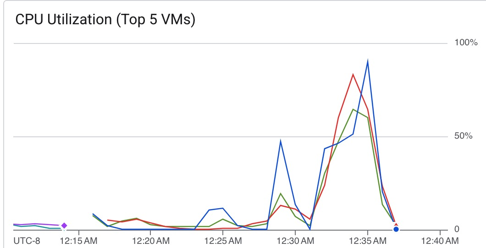

# Scylla Horizontal Scaling

All read tests are 4 threads.

## Single-node

### Write

```
Op rate : 35,307 op/s [WRITE: 35,307 op/s]
Partition rate : 35,307 pk/s [WRITE: 35,307 pk/s]
Row rate : 35,307 row/s [WRITE: 35,307 row/s]
Latency mean : 5.5 ms [WRITE: 5.5 ms]
Latency median : 4.6 ms [WRITE: 4.6 ms]
Latency 95th percentile : 12.5 ms [WRITE: 12.5 ms]
Latency 99th percentile : 18.3 ms [WRITE: 18.3 ms]
Latency 99.9th percentile : 27.7 ms [WRITE: 27.7 ms]
Latency max : 435.2 ms [WRITE: 435.2 ms]
Total partitions : 1,000,000 [WRITE: 1,000,000]
Total errors : 0 [WRITE: 0]
Total GC count : 0
Total GC memory : 0.000 KiB
Total GC time : 0.0 seconds
Avg GC time : NaN ms
StdDev GC time : 0.0 ms
Total operation time : 00:00:28
```

### Read

```
Op rate : 9,878 op/s [READ: 9,878 op/s]
Partition rate : 9,878 pk/s [READ: 9,878 pk/s]
Row rate : 9,878 row/s [READ: 9,878 row/s]
Latency mean : 0.4 ms [READ: 0.4 ms]
Latency median : 0.4 ms [READ: 0.4 ms]
Latency 95th percentile : 0.6 ms [READ: 0.6 ms]
Latency 99th percentile : 0.8 ms [READ: 0.8 ms]
Latency 99.9th percentile : 2.5 ms [READ: 2.5 ms]
Latency max : 11.5 ms [READ: 11.5 ms]
Total partitions : 1,000,000 [READ: 1,000,000]
Total errors : 0 [READ: 0]
Total GC count : 0
Total GC memory : 0.000 KiB
Total GC time : 0.0 seconds
Avg GC time : NaN ms
StdDev GC time : 0.0 ms
Total operation time : 00:01:41
```

## 2-node cluster

### Write

```
Results:
Op rate : 38,937 op/s [WRITE: 38,937 op/s]
Partition rate : 38,937 pk/s [WRITE: 38,937 pk/s]
Row rate : 38,937 row/s [WRITE: 38,937 row/s]
Latency mean : 5.0 ms [WRITE: 5.0 ms]
Latency median : 4.5 ms [WRITE: 4.5 ms]
Latency 95th percentile : 10.2 ms [WRITE: 10.2 ms]
Latency 99th percentile : 15.9 ms [WRITE: 15.9 ms]
Latency 99.9th percentile : 27.6 ms [WRITE: 27.6 ms]
Latency max : 51.1 ms [WRITE: 51.1 ms]
Total partitions : 1,000,000 [WRITE: 1,000,000]
Total errors : 0 [WRITE: 0]
Total GC count : 0
Total GC memory : 0.000 KiB
Total GC time : 0.0 seconds
Avg GC time : NaN ms
StdDev GC time : 0.0 ms
Total operation time : 00:00:25
```

### Read

```
Results:
Op rate : 9,928 op/s [READ: 9,928 op/s]
Partition rate : 9,928 pk/s [READ: 9,928 pk/s]
Row rate : 9,928 row/s [READ: 9,928 row/s]
Latency mean : 0.4 ms [READ: 0.4 ms]
Latency median : 0.3 ms [READ: 0.3 ms]
Latency 95th percentile : 0.7 ms [READ: 0.7 ms]
Latency 99th percentile : 1.0 ms [READ: 1.0 ms]
Latency 99.9th percentile : 2.4 ms [READ: 2.4 ms]
Latency max : 9.5 ms [READ: 9.5 ms]
Total partitions : 1,000,000 [READ: 1,000,000]
Total errors : 0 [READ: 0]
Total GC count : 0
Total GC memory : 0.000 KiB
Total GC time : 0.0 seconds
Avg GC time : NaN ms
StdDev GC time : 0.0 ms
Total operation time : 00:01:40
```



## 3-node cluster

### Write

```
Results:
Op rate : 39,182 op/s [WRITE: 39,182 op/s]
Partition rate : 39,182 pk/s [WRITE: 39,182 pk/s]
Row rate : 39,182 row/s [WRITE: 39,182 row/s]
Latency mean : 4.9 ms [WRITE: 4.9 ms]
Latency median : 4.3 ms [WRITE: 4.3 ms]
Latency 95th percentile : 10.0 ms [WRITE: 10.0 ms]
Latency 99th percentile : 16.7 ms [WRITE: 16.7 ms]
Latency 99.9th percentile : 43.5 ms [WRITE: 43.5 ms]
Latency max : 162.7 ms [WRITE: 162.7 ms]
Total partitions : 1,000,000 [WRITE: 1,000,000]
Total errors : 0 [WRITE: 0]
Total GC count : 0
Total GC memory : 0.000 KiB
Total GC time : 0.0 seconds
Avg GC time : NaN ms
StdDev GC time : 0.0 ms
Total operation time : 00:00:25
```

### Read

```
Results:
Op rate : 14,082 op/s [READ: 14,082 op/s]
Partition rate : 14,082 pk/s [READ: 14,082 pk/s]
Row rate : 14,082 row/s [READ: 14,082 row/s]
Latency mean : 0.3 ms [READ: 0.3 ms]
Latency median : 0.2 ms [READ: 0.2 ms]
Latency 95th percentile : 0.4 ms [READ: 0.4 ms]
Latency 99th percentile : 0.6 ms [READ: 0.6 ms]
Latency 99.9th percentile : 2.2 ms [READ: 2.2 ms]
Latency max : 11.3 ms [READ: 11.3 ms]
Total partitions : 1,000,000 [READ: 1,000,000]
Total errors : 0 [READ: 0]
Total GC count : 0
Total GC memory : 0.000 KiB
Total GC time : 0.0 seconds
Avg GC time : NaN ms
StdDev GC time : 0.0 ms
Total operation time : 00:01:11
```


